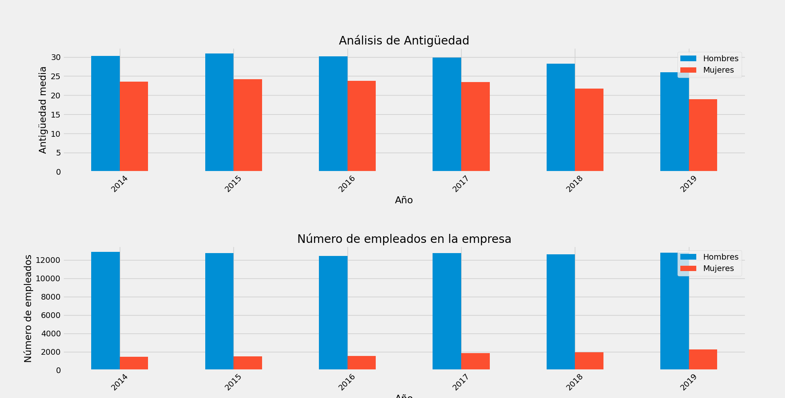
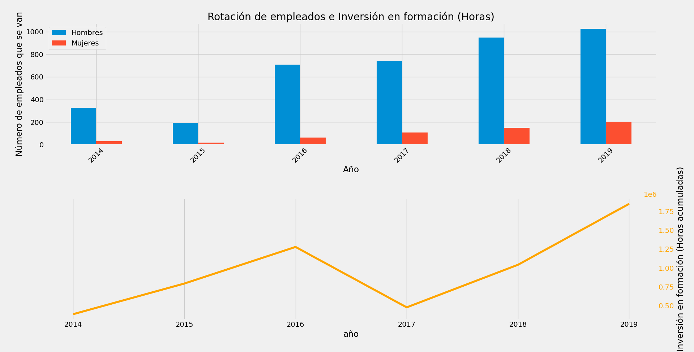
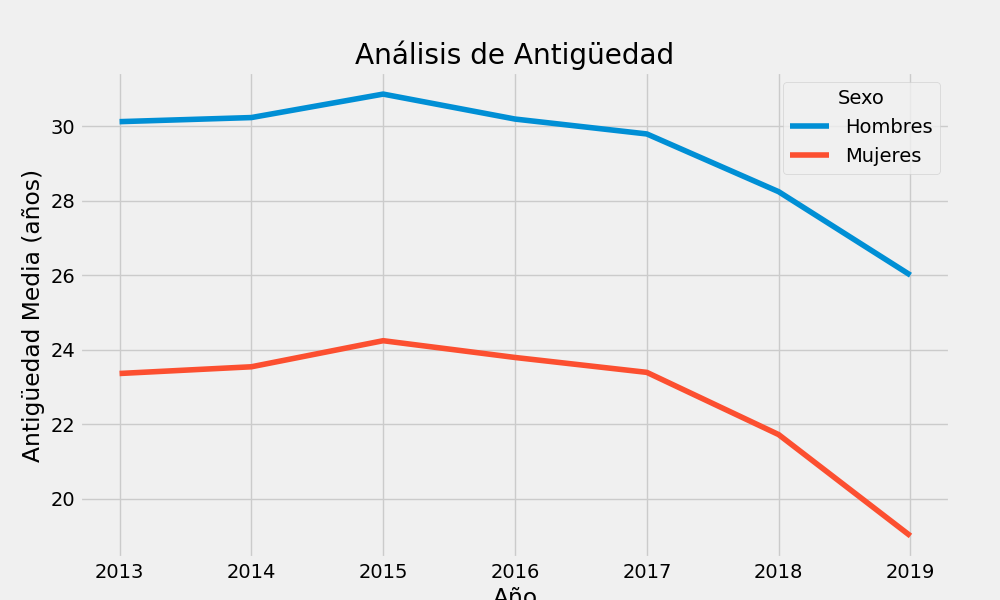
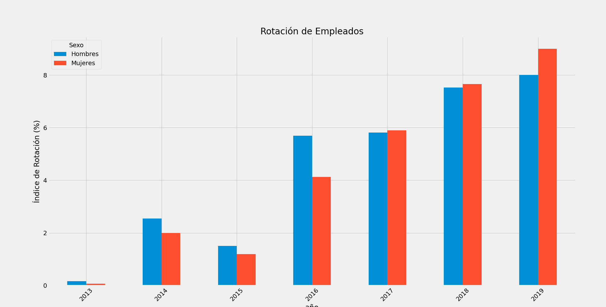
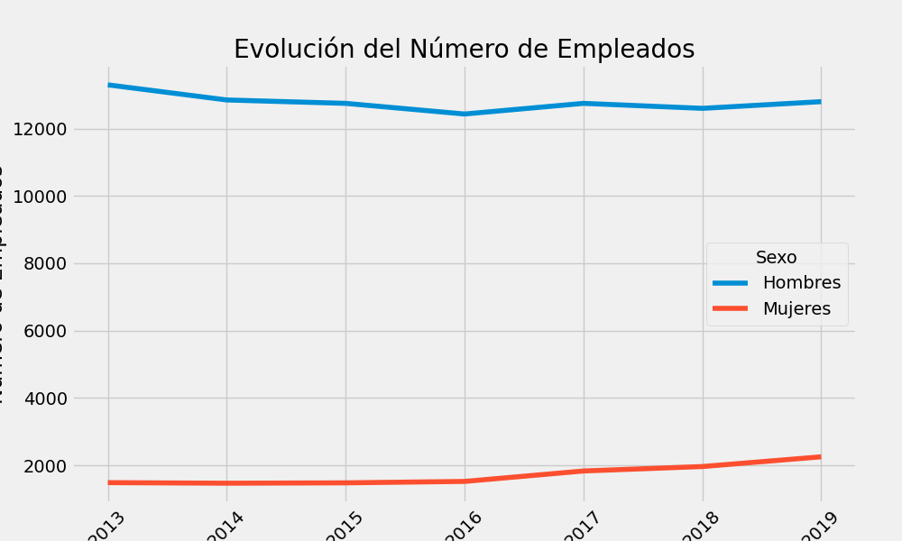
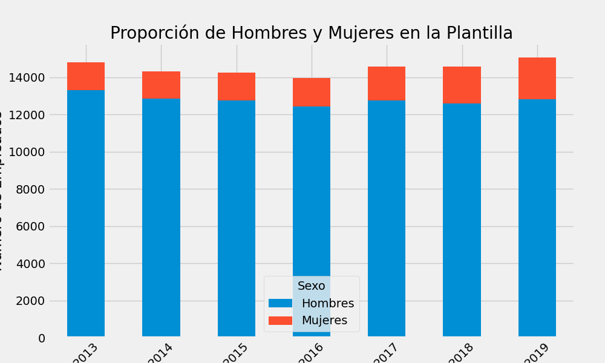

# Análisis RENFE RRHH
### AUTOR: Albert Gil López (https://www.linkedin.com/in/albertgilopez/)

Este repositorio contiene un análisis detallado del dataset público de RENFE con datos relacionados con los recursos humanos de la compañía hasta el 2019 que puedes descargar de su web.

Se utilizan técnicas de análisis de datos y visualización para explorar y entender los datos. Se realiza una limpieza y transformación de los datos, así como la creación de nuevas variables para obtener más información de los datos.

Uno de los hallazgos clave del análisis fue la realización de un análisis de Pareto para examinar la distribución de la inversión en la comunidad. Se puede observar en el gráfico que un pequeño porcentaje de los años representa una gran proporción de la inversión total en la comunidad. En concreto, los años 2014 y 2015 representaron más del 50% de la inversión total en la comunidad.

### Gráfico de la inversión en la comunidad (Análisis de Pareto):
Este gráfico muestra que en los años 2014 y 2015 se realió el 50% de la inversión total en la comunidad. 
Los valores en el eje x son los años de los elementos en el conjunto ordenado, mientras que los valores en el eje y son los porcentajes acumulados de la inversión.

### Gráfico de la Antiguedad de los Empleados VS Número de Empleados:
El primer gráfico muestra la antigüedad media de los empleados (hombres y mujeres) en la empresa a lo largo de los años.
Los valores en el eje x son los años, y los valores en el eje y son las antigüedades medias de los empleados en años.

El segundo gráfico muestra la cantidad total de empleados (hombres y mujeres) en la empresa en cada año.
Los valores en el eje x son los años, y los valores en el eje y son el número total de empleados en cada año.

### Gráfico de la Rotación de Empleados VS Inversión en Formación
El primer gráfico muestra el número de empleados (hombres y mujeres) que dejaron la empresa en cada año.
Los valores en el eje x son los años, y los valores en el eje y son el número de empleados que se fueron en cada año.

El segundo gráfico muestra la cantidad de inversión en formación acumulada a lo largo de los años en la empresa.
Los valores en el eje x son los años, y los valores en el eje y son las horas totales de formación acumuladas.

Nuevo análisis del dataset aplicando métodos de estructuras de datos para business analytics:

### Gráfico de la Antigüedad Media a lo Largo del Tiempo
Este gráfico muestra que la antigüedad media de los empleados ha disminuido ligeramente a lo largo del tiempo tanto para hombres como para mujeres.

### Gráfico del Índice de Rotación a lo Largo del Tiempo
Este gráfico muestra que el índice de rotación ha aumentado a lo largo del tiempo tanto para hombres como para mujeres, lo que indica que la rotación de empleados ha sido más alta en los años más recientes.

### Gráfico de la Evolución del Número de Empleados con el Tiempo
Este gráfico de líneas muestra cómo ha cambiado el número de empleados en la empresa a lo largo de los años, diferenciando entre hombres y mujeres.
 

### Gráfico de la Proporción de Hombres y Mujeres en la Plantilla
Este gráfico muestra cómo ha cambiado la proporción de hombres y mujeres en la plantilla a lo largo del tiempo usando un gráfico de barras apiladas.

