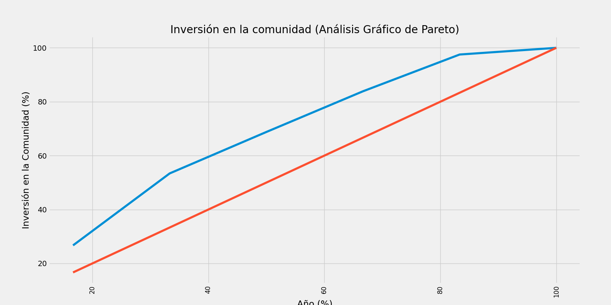

# Análisis RENFE RRHH
### AUTOR: Albert Gil López (https://www.linkedin.com/in/albertgilopez/)

En este proyecto, se realiza un análisis detallado de los datos de la inversión en la comunidad por parte de RENFE de los años 2014 a 2019. Se utilizan técnicas de análisis de datos y visualización para explorar y entender los datos. Se realiza una limpieza y transformación de los datos, así como la creación de nuevas variables para obtener más información de los datos.

Uno de los hallazgos clave del análisis fue la realización de un análisis de Pareto para examinar la distribución de la inversión en la comunidad. Se puede observar en el gráfico que un pequeño porcentaje de los años representa una gran proporción de la inversión total en la comunidad. En concreto, los años 2014 y 2015 representaron más del 50% de la inversión total en la comunidad.

### Gráfico de la inversión en la comunidad (Análisis de Pareto):
Este gráfico muestra que en los años 2014 y 2015 se realió el 50% de la inversión total en la comunidad. 
Los valores en el eje x son los años de los elementos en el conjunto ordenado, mientras que los valores en el eje y son los porcentajes acumulados de la inversión.

### Gráfico de la Antiguedad de los Empleados VS Número de Empleados:
El primer gráfico muestra la antigüedad media de los empleados (hombres y mujeres) en la empresa a lo largo de los años.
Los valores en el eje x son los años, y los valores en el eje y son las antigüedades medias de los empleados en años.

El segundo gráfico muestra la cantidad total de empleados (hombres y mujeres) en la empresa en cada año.
Los valores en el eje x son los años, y los valores en el eje y son el número total de empleados en cada año.

### Gráfico de la Rotación de Empleados VS Inversión en Formación
El primer gráfico muestra el número de empleados (hombres y mujeres) que dejaron la empresa en cada año.
Los valores en el eje x son los años, y los valores en el eje y son el número de empleados que se fueron en cada año.

El segundo gráfico muestra la cantidad de inversión en formación acumulada a lo largo de los años en la empresa.
Los valores en el eje x son los años, y los valores en el eje y son las horas totales de formación acumuladas.

